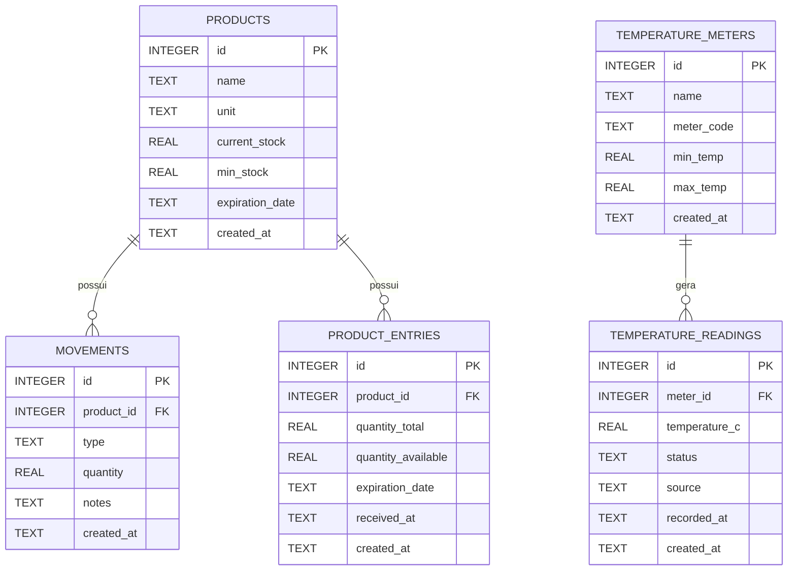

# Estrutura do Banco de Dados

Motor do banco: `SQLite`  
Caminho do arquivo: `data/merenda-certa.db`

## Visão geral

Principais áreas funcionais:
- Estoque (`products`, `product_entries`, `movements`)
- Monitoramento de temperatura (`temperature_meters`, `temperature_readings`)

## Tabelas

### `products`

| Coluna | Tipo | Restrições | Observações |
|---|---|---|---|
| `id` | INTEGER | PK, AUTOINCREMENT | Identificador do produto |
| `name` | TEXT | NOT NULL | Nome do produto |
| `unit` | TEXT | NOT NULL, DEFAULT `'kg'` | Unidade de medida |
| `current_stock` | REAL | NOT NULL, DEFAULT `0` | Campo de compatibilidade legado/atual |
| `min_stock` | REAL | NOT NULL, DEFAULT `0` | Limite mínimo de estoque |
| `expiration_date` | TEXT | NULL | Campo legado de validade |
| `created_at` | TEXT | NOT NULL, DEFAULT `CURRENT_TIMESTAMP` | Data/hora de criação |

### `movements`

| Coluna | Tipo | Restrições | Observações |
|---|---|---|---|
| `id` | INTEGER | PK, AUTOINCREMENT | Identificador da movimentação |
| `product_id` | INTEGER | NOT NULL, FK -> `products.id` ON DELETE CASCADE | Produto relacionado |
| `type` | TEXT | NOT NULL, CHECK IN (`'IN'`, `'OUT'`, `'DISCARD'`) | Tipo de movimentação |
| `quantity` | REAL | NOT NULL, CHECK `> 0` | Quantidade movimentada |
| `notes` | TEXT | NULL | Observações opcionais |
| `created_at` | TEXT | NOT NULL, DEFAULT `CURRENT_TIMESTAMP` | Data/hora da movimentação |

### `product_entries`

| Coluna | Tipo | Restrições | Observações |
|---|---|---|---|
| `id` | INTEGER | PK, AUTOINCREMENT | Identificador da entrada/lote |
| `product_id` | INTEGER | NOT NULL, FK -> `products.id` ON DELETE CASCADE | Produto relacionado |
| `quantity_total` | REAL | NOT NULL, CHECK `> 0` | Quantidade inicial do lote |
| `quantity_available` | REAL | NOT NULL, CHECK `>= 0` | Quantidade restante no lote |
| `expiration_date` | TEXT | NOT NULL | Data de validade do lote |
| `received_at` | TEXT | NOT NULL, DEFAULT `CURRENT_TIMESTAMP` | Data/hora de recebimento do lote |
| `created_at` | TEXT | NOT NULL, DEFAULT `CURRENT_TIMESTAMP` | Data/hora de criação do registro |

### `temperature_meters`

| Coluna | Tipo | Restrições | Observações |
|---|---|---|---|
| `id` | INTEGER | PK, AUTOINCREMENT | Identificador do medidor |
| `name` | TEXT | NOT NULL | Nome de exibição |
| `meter_code` | TEXT | NOT NULL, UNIQUE | Código MQTT/dispositivo |
| `min_temp` | REAL | NOT NULL | Limite mínimo válido |
| `max_temp` | REAL | NOT NULL | Limite máximo válido |
| `created_at` | TEXT | NOT NULL, DEFAULT `CURRENT_TIMESTAMP` | Data/hora de criação |

### `temperature_readings`

| Coluna | Tipo | Restrições | Observações |
|---|---|---|---|
| `id` | INTEGER | PK, AUTOINCREMENT | Identificador da leitura |
| `meter_id` | INTEGER | NOT NULL, FK -> `temperature_meters.id` ON DELETE CASCADE | Medidor relacionado |
| `temperature_c` | REAL | NOT NULL | Valor da temperatura |
| `status` | TEXT | NOT NULL, CHECK IN (`'SAFE'`, `'ALERT'`) | Status com base nos limites do medidor |
| `source` | TEXT | NOT NULL, CHECK IN (`'MQTT'`, `'MANUAL'`) | Origem da leitura |
| `recorded_at` | TEXT | NOT NULL, DEFAULT `CURRENT_TIMESTAMP` | Data/hora da leitura |
| `created_at` | TEXT | NOT NULL, DEFAULT `CURRENT_TIMESTAMP` | Data/hora de criação da linha |

## Relacionamentos

- `products (1) -> (N) movements`
- `products (1) -> (N) product_entries`
- `temperature_meters (1) -> (N) temperature_readings`

Regra de negócio relevante:
- Movimentação `DISCARD` (Descarte) é permitida apenas para quantidade disponível em lotes vencidos (`expiration_date < data atual`).

## Diagrama ER (Mermaid)

## Valores padrão inseridos na inicialização

Ao iniciar a aplicação, os medidores abaixo são inseridos/atualizados (upsert) por `meter_code`:
- `medidor-1` (60 a 75 C)
- `medidor-2` (58 a 74 C)
- `medidor-3` (59 a 73 C)
- `medidor-4` (60 a 76 C)
