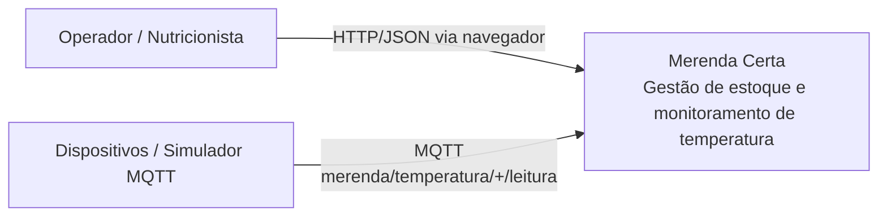
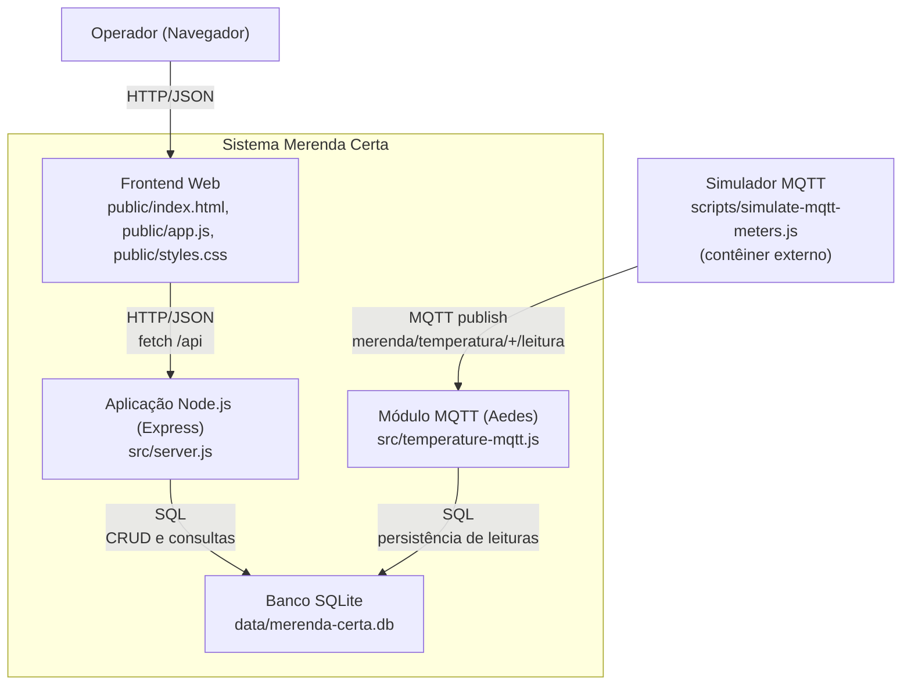
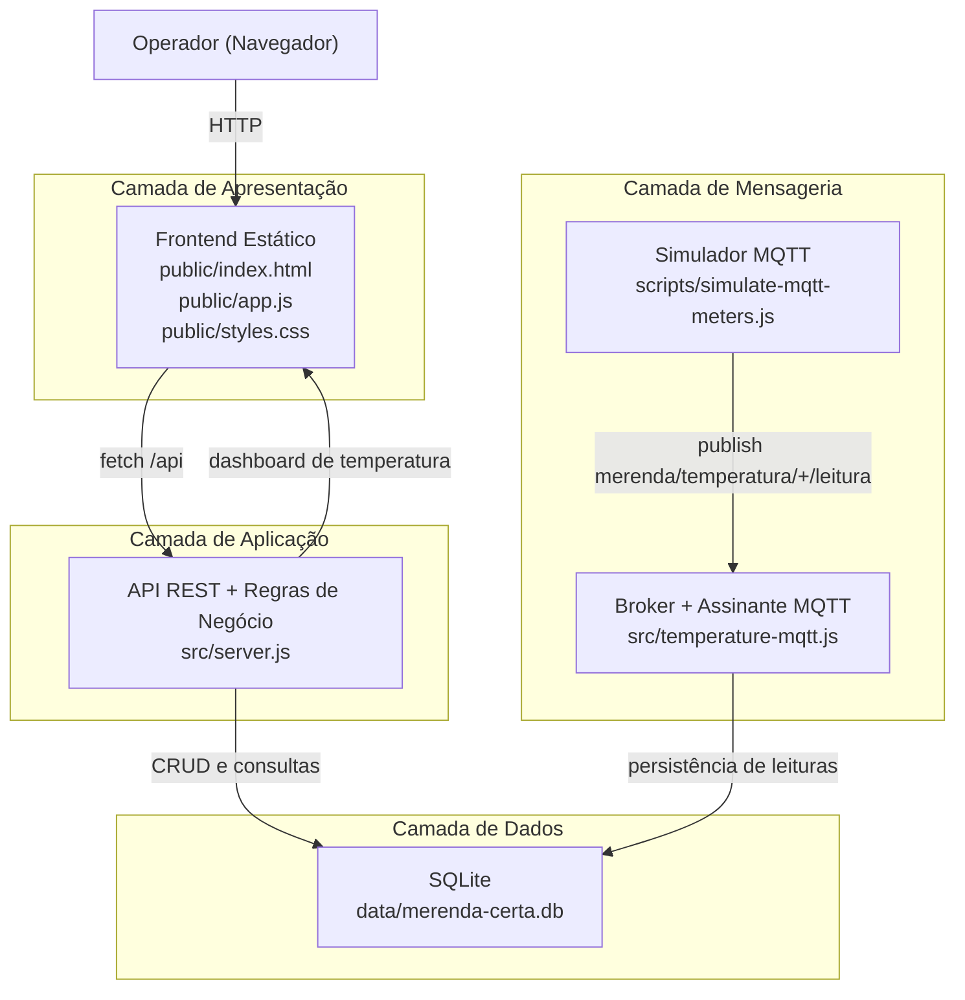

# Arquitetura do Projeto

## 1. Visão geral

O **Merenda Certa** adota arquitetura monolítica em Node.js, com foco em simplicidade para operação local e demonstração acadêmica.

Componentes centrais:
- Backend HTTP (Express) com regras de negócio.
- Banco SQLite local.
- Frontend estático (HTML/CSS/JS) servido pelo próprio backend.
- Broker MQTT embarcado na aplicação para leituras de temperatura.
- Simulador MQTT para geração contínua de dados de teste.

## 2. Modelo C4 (Mermaid)

### 2.1 C1 - Contexto do Sistema

Este diagrama mostra os atores/sistemas externos e como se relacionam com o sistema principal.

### 2.2 C2 - Contêineres

Este diagrama detalha os principais contêineres internos do sistema e seus protocolos de integração.

## 3. Diagrama de camadas (Mermaid)

A visão C4 descreve quem interage com o sistema e como os contêineres se conectam. O diagrama de camadas complementa essa visão ao mostrar a organização interna do monólito por responsabilidade técnica.

## 4. Arquitetura lógica

### 4.1 Camada de apresentação

- Local: `public/index.html`, `public/styles.css`, `public/app.js`
- Responsabilidades:
  - Renderizar páginas de Painel, Produtos, Movimentações, Temperatura e Sobre.
  - Consumir API REST via `fetch`.
  - Atualizar dashboard de temperatura a cada 10 segundos.

### 4.2 Camada de aplicação (API)

- Local: `src/server.js`
- Responsabilidades:
  - Expor endpoints `/api/*`.
  - Validar entradas e aplicar regras de negócio.
  - Controlar estoque por lote (entrada com validade e saída por consumo de lotes).
  - Consolidar indicadores para tomada de decisão no painel.
  - Servir arquivos estáticos da pasta `public`.

### 4.3 Camada de mensageria (MQTT)

- Local: `src/temperature-mqtt.js`
- Responsabilidades:
  - Inicializar broker local (Aedes) e cliente assinante.
  - Escutar tópico `merenda/temperatura/+/leitura`.
  - Converter payload JSON em leituras persistidas.
  - Classificar leitura como `SAFE` ou `ALERT` com base em `min_temp` e `max_temp`.

### 4.4 Camada de dados

- Local: `src/db.js`
- Banco: `data/merenda-certa.db` (SQLite)
- Configuração:
  - `PRAGMA journal_mode = WAL`
  - `PRAGMA foreign_keys = ON`
- Principais entidades:
  - `products`: cadastro base do item (nome, unidade, estoque mínimo).
  - `product_entries`: entradas por lote com validade e saldo disponível.
  - `movements`: registros de entrada/saída operacional.
  - `temperature_meters`: medidores e faixas mínima/máxima.
  - `temperature_readings`: histórico de leituras por medidor.

## 5. Fluxos principais

### 5.1 Fluxo de estoque por lote

1. Produto é cadastrado em `products`.
2. Entradas são registradas em `product_entries` com data de recebimento e validade.
3. Saídas são registradas em `movements` e consomem saldos de lotes disponíveis.
4. Painel consolida:
  - estoque baixo;
  - produtos a vencer em 14/7/3 dias;
  - recomendações de uso e reposição.

### 5.2 Fluxo de monitoramento de temperatura

1. Medidor é cadastrado em `temperature_meters` com limite mínimo e máximo.
2. Simulador (ou dispositivo real) publica temperatura via MQTT.
3. API persiste leitura em `temperature_readings`.
4. Tela de temperatura exibe status visual por medidor e últimas leituras.

## 6. Estrutura física de pastas

- `src/`: API, acesso a dados e módulo MQTT.
- `public/`: interface web e ativos visuais.
- `scripts/`: seed de dados e simulador MQTT.
- `data/`: arquivo SQLite.
- `Dockerfile` e `docker-compose.yml`: empacotamento e execução em contêiner.

## 7. Execução

### 7.1 Ambiente local

- `npm start`: sobe API + frontend + broker MQTT.
- `npm run seed:test`: carrega dados de teste.
- `npm run mqtt:sim`: inicia simulador de envio MQTT.

### 7.2 Docker Compose

- Serviço `app`:
  - executa `npm run seed:test && npm start`;
  - expõe web em `http://localhost` (porta `80:3000`);
  - expõe broker MQTT em `mqtt://localhost:1883`.
- Serviço `mqtt-sim`:
  - depende do `app`;
  - envia leituras periódicas para o broker interno.

## 8. Decisões de arquitetura

- Monolito com SQLite: reduz complexidade operacional no contexto do PI.
- Broker MQTT embarcado: simplifica setup de laboratório/demonstração.
- Frontend sem framework: menor curva de manutenção.
- Scripts de seed e simulação: garantem reprodutibilidade para testes e apresentação.

## 9. Evoluções recomendadas

- Separar broker MQTT em serviço dedicado para produção.
- Implementar autenticação/autorização.
- Adicionar testes automatizados de API e interface.
- Introduzir migrações versionadas de banco.
- Evoluir observabilidade (logs estruturados e métricas).
